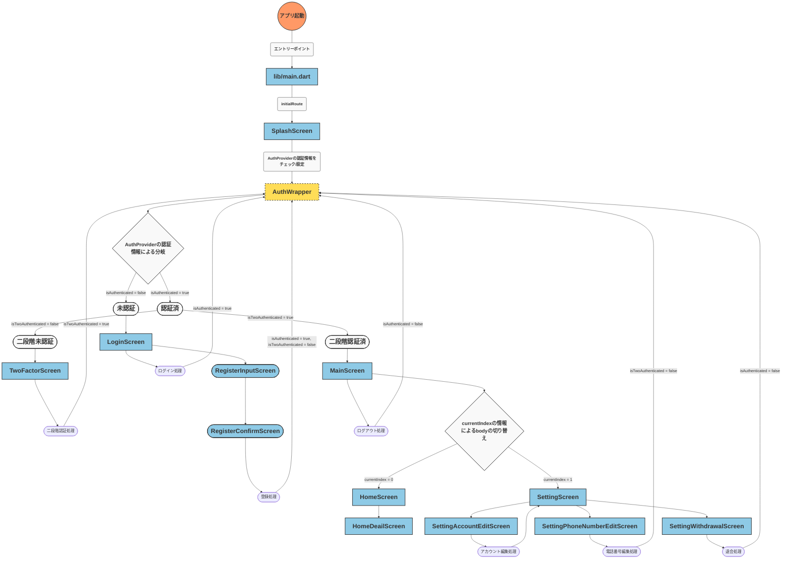
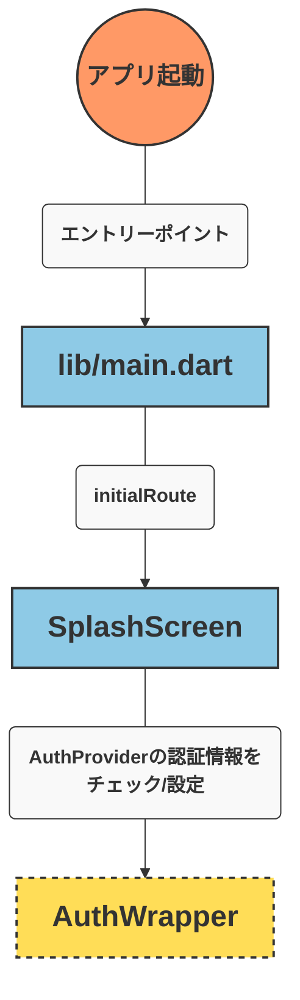
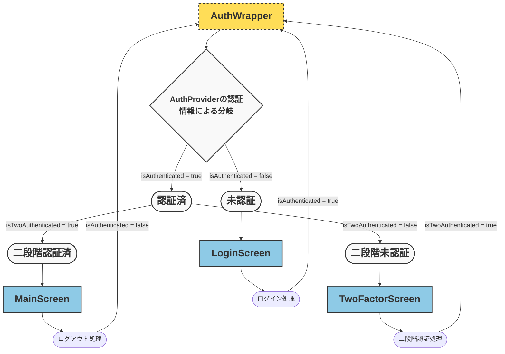
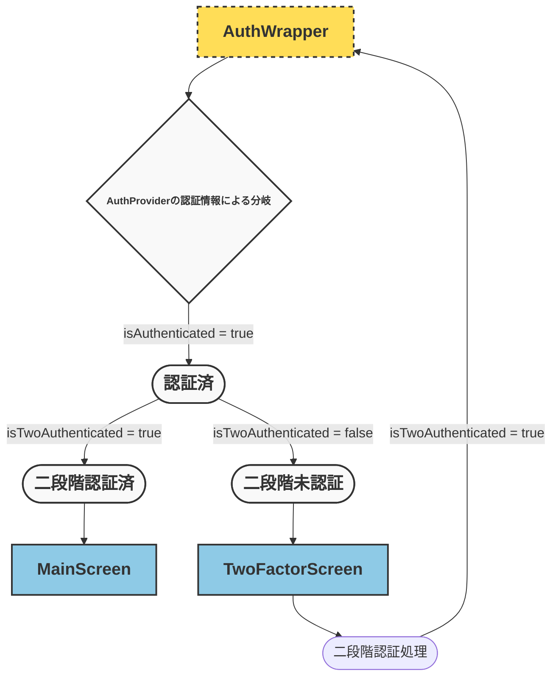
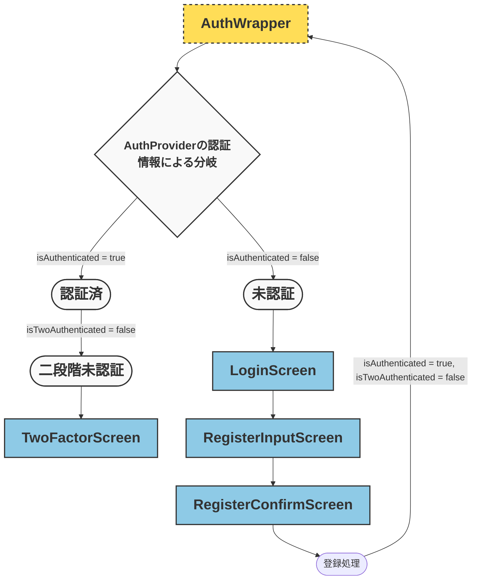
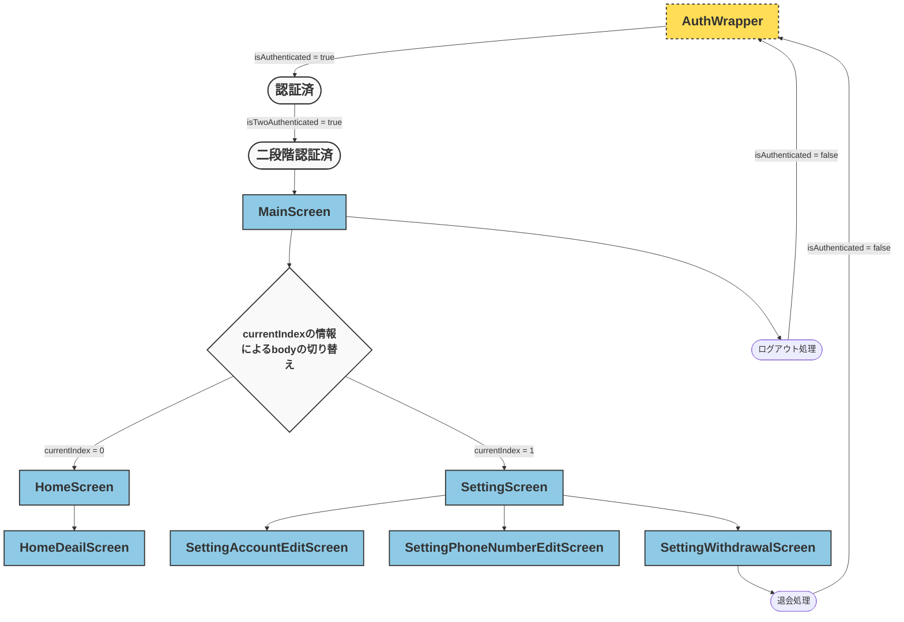

```mermaid
flowchart TB
    %% ノードのスタイル設定
    classDef startEnd fill:#f96,stroke:#333,stroke-width:2px,font-size: 20px,font-weight: bold;
    classDef screen fill:#8ecae6,stroke:#333,stroke-width:2px,font-size: 25px,font-weight: bold;
    classDef decision fill:#ffdd57,stroke:#333,stroke-width:2px,stroke-dasharray: 5 5,font-size: 25px,font-weight: bold;
    classDef widget fill:lightgreen,stroke:#333,stroke-width:2px,font-size: 25px,font-weight: bold;
    classDef description fill:#f9f9f9,stroke:#333,stroke-width:2px,font-size: 20px,font-weight: bold;
    classDef provider fill:#f9f9f9,stroke:#333,stroke-width:2px,font-size: 25px,font-weight: bold;
    classDef state fill:#f9f9f9,stroke:#333,storke-width:1px,font-size: 16px,font-weight: bold;

    %% ノードの作成
    Start((アプリ起動)):::startEnd --- EntryPoint(エントリーポイント):::state --> MainFile[lib/main.dart]:::screen
    MainFile --- InitRoute(initialRoute):::state --> SplashScreen[SplashScreen]:::screen
    SplashScreen --- AuthCheck(AuthProviderの認証情報をチェック/設定):::state --> AuthWrapper[AuthWrapper]:::decision

    AuthWrapper --> AuthDecision{AuthProviderの認証情報による分岐}:::description

    %% 分岐処理
    AuthDecision -- isAuthenticated = true --> Authenticated([認証済]):::provider -- isTwoAuthenticated = true --> TwoFactorAuthenticated([二段階認証済]):::provider --> MainScreen[MainScreen]:::screen
    Authenticated -- isTwoAuthenticated = false --> TwoFactorRequired([二段階未認証]):::provider --> TwoFactorScreen[TwoFactorScreen]:::screen
    AuthDecision -- isAuthenticated = false --> Unauthenticated([未認証]):::provider --> LoginScreen[LoginScreen]:::screen

    %% 認証処理
    LoginScreen --> LoginProcess([ログイン処理]) -- isAuthenticated = true  --> AuthWrapper
    TwoFactorScreen --> TwoFactorProcess([二段階認証処理]) -- isTwoAuthenticated = true --> AuthWrapper

    %% LoginScreenの処理
    LoginScreen --> Register([RegisterInputScreen]):::screen --> RegisterConfirm([RegisterConfirmScreen]):::screen --> RegisterProcess([登録処理]) -- isAuthenticated = true, isTwoAuthenticated = false --> AuthWrapper


    %% MainScreenの処理
    MainScreen --> BodySwitch{currentIndexの情報によるbodyの切り替え}:::description
    BodySwitch -- currentIndex = 0 --> HomeScreen[HomeScreen]:::screen
    BodySwitch -- currentIndex = 1 --> SettingScreen[SettingScreen]:::screen
    MainScreen --> Logout([ログアウト処理]) -- isAuthenticated = false --> AuthWrapper

    %% HomeScreenの処理
    HomeScreen --> HomeDetail[HomeDeailScreen]:::screen

    %% SettingScreenの処理
    SettingScreen --> AccountEdit[SettingAccountEditScreen]:::screen --> AccountEditProcess([アカウント編集処理]) --> SettingScreen
    SettingScreen --> PhoneEdit[SettingPhoneNumberEditScreen]:::screen　--> PhoneEditProcess([電話番号編集処理]) -- isTwoAuthenticated = false --> AuthWrapper
    SettingScreen --> Withdrawal[SettingWithdrawalScreen]:::screen
    Withdrawal --> WithdrawProcess([退会処理]) -- isAuthenticated = false --> AuthWrapper
```

```mermaid
flowchart TB
    %% ノードのスタイル設定
    classDef startEnd fill:#f96,stroke:#333,stroke-width:2px,font-size: 20px,font-weight: bold;
    classDef screen fill:#8ecae6,stroke:#333,stroke-width:2px,font-size: 25px,font-weight: bold;
    classDef decision fill:#ffdd57,stroke:#333,stroke-width:2px,stroke-dasharray: 5 5,font-size: 25px,font-weight: bold;
    classDef widget fill:lightgreen,stroke:#333,stroke-width:2px,font-size: 25px,font-weight: bold;
    classDef description fill:#f9f9f9,stroke:#333,stroke-width:2px,font-size: 20px,font-weight: bold;
    classDef provider fill:#f9f9f9,stroke:#333,stroke-width:2px,font-size: 25px,font-weight: bold;
    classDef state fill:#f9f9f9,stroke:#333,storke-width:1px,font-size: 16px,font-weight: bold;

    %% ノードの作成
    Start((アプリ起動)):::startEnd --- EntryPoint(エントリーポイント):::state --> MainFile[lib/main.dart]:::screen
    MainFile --- InitRoute(initialRoute):::state --> SplashScreen[SplashScreen]:::screen
    SplashScreen --- AuthCheck(AuthProviderの認証情報をチェック/設定):::state --> AuthWrapper[AuthWrapper]:::decision

```

```mermaid
flowchart TB
    %% ノードのスタイル設定
    classDef startEnd fill:#f96,stroke:#333,stroke-width:2px,font-size: 20px,font-weight: bold;
    classDef screen fill:#8ecae6,stroke:#333,stroke-width:2px,font-size: 25px,font-weight: bold;
    classDef decision fill:#ffdd57,stroke:#333,stroke-width:2px,stroke-dasharray: 5 5,font-size: 25px,font-weight: bold;
    classDef widget fill:lightgreen,stroke:#333,stroke-width:2px,font-size: 25px,font-weight: bold;
    classDef description fill:#f9f9f9,stroke:#333,stroke-width:2px,font-size: 20px,font-weight: bold;
    classDef provider fill:#f9f9f9,stroke:#333,stroke-width:2px,font-size: 25px,font-weight: bold;
    classDef state fill:#f9f9f9,stroke:#333,storke-width:1px,font-size: 16px,font-weight: bold;

   AuthWrapper[AuthWrapper]:::decision --> AuthDecision{AuthProviderの認証情報による分岐}:::description

    %% 分岐処理
    AuthDecision -- isAuthenticated = true --> Authenticated([認証済]):::provider -- isTwoAuthenticated = true --> TwoFactorAuthenticated([二段階認証済]):::provider --> MainScreen[MainScreen]:::screen
    Authenticated -- isTwoAuthenticated = false --> TwoFactorRequired([二段階未認証]):::provider --> TwoFactorScreen[TwoFactorScreen]:::screen
    AuthDecision -- isAuthenticated = false --> Unauthenticated([未認証]):::provider --> LoginScreen[LoginScreen]:::screen

    %% 認証処理
    LoginScreen --> LoginProcess([ログイン処理]) -- isAuthenticated = true  --> AuthWrapper
    TwoFactorScreen --> TwoFactorProcess([二段階認証処理]) -- isTwoAuthenticated = true --> AuthWrapper
    MainScreen --> Logout([ログアウト処理]) -- isAuthenticated = false --> AuthWrapper
```

```mermaid
flowchart TB
    %% ノードのスタイル設定
    classDef startEnd fill:#f96,stroke:#333,stroke-width:2px,font-size: 20px,font-weight: bold;
    classDef screen fill:#8ecae6,stroke:#333,stroke-width:2px,font-size: 20px,font-weight: bold;
    classDef decision fill:#ffdd57,stroke:#333,stroke-width:2px,stroke-dasharray: 5 5,font-size: 20px,font-weight: bold;
    classDef widget fill:lightgreen,stroke:#333,stroke-width:2px,font-size: 20px,font-weight: bold;
    classDef description fill:#f9f9f9,stroke:#333,stroke-width:2px,font-size: 12px,font-weight: bold;
    classDef provider fill:#f9f9f9,stroke:#333,stroke-width:2px,font-size: 20px,font-weight: bold;
    classDef state fill:#f9f9f9,stroke:#333,storke-width:1px,font-size: 16px,font-weight: bold;

   AuthWrapper[AuthWrapper]:::decision --> AuthDecision{AuthProviderの認証情報による分岐}:::description

    %% 分岐処理
    AuthDecision -- isAuthenticated = true --> Authenticated([認証済]):::provider -- isTwoAuthenticated = true --> TwoFactorAuthenticated([二段階認証済]):::provider --> MainScreen[MainScreen]:::screen
    Authenticated -- isTwoAuthenticated = false --> TwoFactorRequired([二段階未認証]):::provider --> TwoFactorScreen[TwoFactorScreen]:::screen

    %% 認証処理
    TwoFactorScreen --> TwoFactorProcess([二段階認証処理]) -- isTwoAuthenticated = true --> AuthWrapper
```

```mermaid
flowchart TB
    %% ノードのスタイル設定
    classDef startEnd fill:#f96,stroke:#333,stroke-width:2px,font-size: 20px,font-weight: bold;
    classDef screen fill:#8ecae6,stroke:#333,stroke-width:2px,font-size: 25px,font-weight: bold;
    classDef decision fill:#ffdd57,stroke:#333,stroke-width:2px,stroke-dasharray: 5 5,font-size: 25px,font-weight: bold;
    classDef widget fill:lightgreen,stroke:#333,stroke-width:2px,font-size: 25px,font-weight: bold;
    classDef description fill:#f9f9f9,stroke:#333,stroke-width:2px,font-size: 20px,font-weight: bold;
    classDef provider fill:#f9f9f9,stroke:#333,stroke-width:2px,font-size: 25px,font-weight: bold;
    classDef state fill:#f9f9f9,stroke:#333,storke-width:1px,font-size: 16px,font-weight: bold;

   AuthWrapper[AuthWrapper]:::decision --> AuthDecision{AuthProviderの認証情報による分岐}:::description

    %% 分岐処理
    AuthDecision -- isAuthenticated = true --> Authenticated([認証済]):::provider
    Authenticated -- isTwoAuthenticated = false --> TwoFactorRequired([二段階未認証]):::provider --> TwoFactorScreen[TwoFactorScreen]:::screen
    AuthDecision -- isAuthenticated = false --> Unauthenticated([未認証]):::provider --> LoginScreen[LoginScreen]:::screen

    %% 認証処理
    LoginScreen --> Register[RegisterInputScreen]:::screen --> RegisterConfirm[RegisterConfirmScreen]:::screen --> RegisterProcess([登録処理]) -- isAuthenticated = true, isTwoAuthenticated = false --> AuthWrapper

```

```mermaid
flowchart TB
    %% ノードのスタイル設定
    classDef startEnd fill:#f96,stroke:#333,stroke-width:2px,font-size: 20px,font-weight: bold;
    classDef screen fill:#8ecae6,stroke:#333,stroke-width:2px,font-size: 25px,font-weight: bold;
    classDef decision fill:#ffdd57,stroke:#333,stroke-width:2px,stroke-dasharray: 5 5,font-size: 25px,font-weight: bold;
    classDef widget fill:lightgreen,stroke:#333,stroke-width:2px,font-size: 25px,font-weight: bold;
    classDef description fill:#f9f9f9,stroke:#333,stroke-width:2px,font-size: 20px,font-weight: bold;
    classDef provider fill:#f9f9f9,stroke:#333,stroke-width:2px,font-size: 25px,font-weight: bold;
    classDef state fill:#f9f9f9,stroke:#333,storke-width:1px,font-size: 16px,font-weight: bold;

    %%AuthWrapper[AuthWrapper]:::decision --　認証済・二段間認証済 --> MainScreen[MainScreen]:::screen
    AuthWrapper[AuthWrapper]:::decision -- isAuthenticated = true --> Authenticated([認証済]):::provider -- isTwoAuthenticated = true --> TwoFactorAuthenticated([二段階認証済]):::provider --> MainScreen[MainScreen]:::screen
    %% MainScreenの処理
    MainScreen --> BodySwitch{currentIndexの情報によるbodyの切り替え}:::description
    BodySwitch -- currentIndex = 0 --> HomeScreen[HomeScreen]:::screen
    BodySwitch -- currentIndex = 1 --> SettingScreen[SettingScreen]:::screen
    MainScreen --> Logout([ログアウト処理]) -- isAuthenticated = false --> AuthWrapper

    %% HomeScreenの処理
    HomeScreen --> HomeDetail[HomeDeailScreen]:::screen

    %% SettingScreenの処理
    SettingScreen --> AccountEdit[SettingAccountEditScreen]:::screen
    SettingScreen --> PhoneEdit[SettingPhoneNumberEditScreen]:::screen　
    SettingScreen --> Withdrawal[SettingWithdrawalScreen]:::screen
    Withdrawal --> WithdrawProcess([退会処理]) -- isAuthenticated = false --> AuthWrapper
```