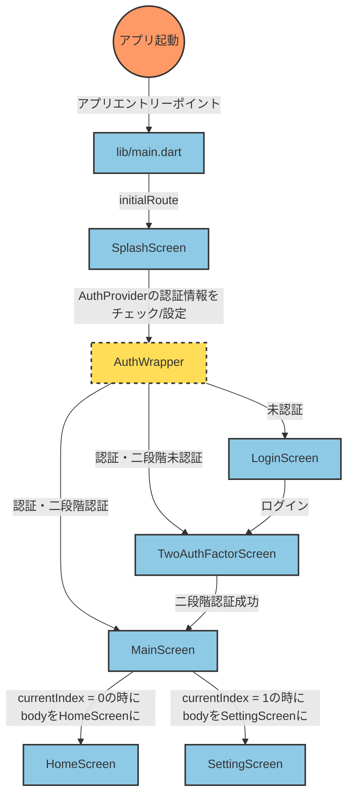

```mermaid
flowchart TB
    %% ノードのスタイル設定
    classDef startEnd fill:#f96,stroke:#333,stroke-width:2px;
    classDef screen fill:#8ecae6,stroke:#333,stroke-width:2px;
    classDef decision fill:#ffdd57,stroke:#333,stroke-width:2px,stroke-dasharray: 5 5;

    %% ノードの作成
    A((アプリ起動)):::startEnd -- アプリエントリーポイント --> B[lib/main.dart]:::screen
    B -- initialRoute --> C[SplashScreen]:::screen
    C -- AuthProviderの認証情報をチェック/設定 --> E[AuthWrapper]:::decision

    %% 分岐処理
    E -- 認証・二段階認証 --> F[MainScreen]:::screen
    E -- 認証・二段階未認証 --> G[TwoAuthFactorScreen]:::screen
    E -- 未認証 --> H[LoginScreen]:::screen

    %% 認証処理
    H -- ログイン --> G
    G -- 二段階認証成功 --> F

    %% MainScreenの処理
    F -- currentIndex = 0の時に bodyをHomeScreenに --> I[HomeScreen]:::screen
    F -- currentIndex = 1の時に bodyをSettingScreenに --> J[SettingScreen]:::screen

```
